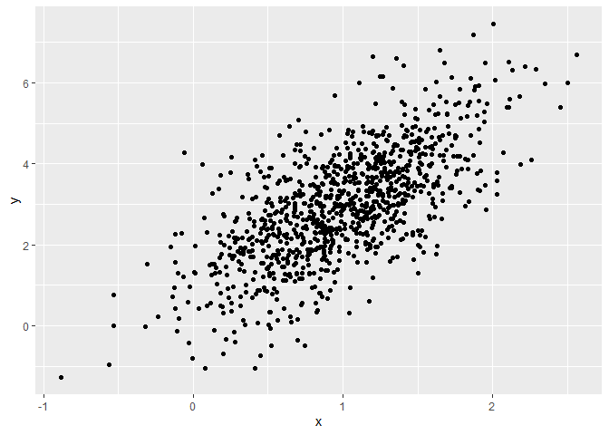

Simple document
================
Eman Ibrahim
09/11/2025

I’m an R Markdown document!

``` r
library(tidyverse)
```

    ## ── Attaching core tidyverse packages ──────────────────────── tidyverse 2.0.0 ──
    ## ✔ dplyr     1.1.4     ✔ readr     2.1.5
    ## ✔ forcats   1.0.0     ✔ stringr   1.5.1
    ## ✔ ggplot2   3.5.2     ✔ tibble    3.3.0
    ## ✔ lubridate 1.9.4     ✔ tidyr     1.3.1
    ## ✔ purrr     1.0.4     
    ## ── Conflicts ────────────────────────────────────────── tidyverse_conflicts() ──
    ## ✖ dplyr::filter() masks stats::filter()
    ## ✖ dplyr::lag()    masks stats::lag()
    ## ℹ Use the conflicted package (<http://conflicted.r-lib.org/>) to force all conflicts to become errors

# Section 1

Here’s a **code chunk** that samples from a *normal distribution*:

``` r
samp = rnorm(100)
length(samp)
```

    ## [1] 100

# Section 2

I can take the mean of the sample, too! The mean is -0.1446032.

# Section 3

This is where I’m going to talk about code chunks.

Let’s also make a dataframe.

``` r
example_df=
  tibble(
    vec_numeric = 1:4,
    vec_char = c("My", "name", "is", "eman"),
    vec_factor = factor(c("male", "male", "female", "female"))
  )
```

I’ll create a new dataframe.

``` r
new_df=
  tibble(
    x = rnorm(100),
    y = 1 + 2 * x + rnorm(100)
  )
```

Let’s make a plot and see how cool that is!

``` r
plot_df =
  tibble(
    x=rnorm(1000, mean=1, sd=.5),
    y=1+2*x+rnorm(1000)
  )
ggplot(plot_df, aes(x=x, y=y))+geom_point()
```

<!-- -->

This is a neat scatterplot!!!
